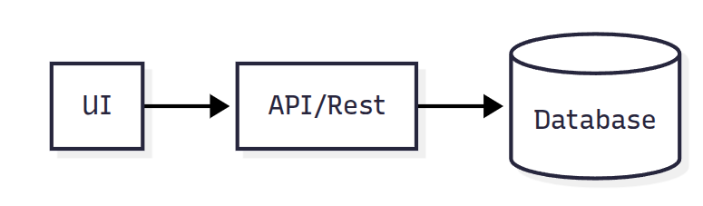

# Documento de Arquitetura — Plataforma de Gestão de Networking

## 1. Visão Geral

Este documento descreve a arquitetura para o projeto **NetworkerGroup**, cujo objetivo é facilitar a gestão de membros, indicações de negócios, reuniões gerais e privadas entre membros, comunicações internas do grupo, sanando problemas de gestão manual em documentos físicos.

Este é um projeto **Fullstack** encaminhado à **boas práticas** e **perfomance**, levando em consideração a **componentização** adequada e os **testes** centrais.

### Objetivos do Sistema
- Centralizar o cadastro e gestão de membros.
- Facilitar comunicações e controle de presença (check-in).
- Permitir o registro e acompanhamento de indicações de negócios.
- Disponibilizar dashboards de desempenho e relatórios financeiros.
- Controle e geração de mensalidades
---

## 2. Stack Técnica

| Camada | Tecnologia | Justificativa |
|--------|-------------|----------------|
| **Front-end** | Next.js + React + TypeScript | SSR, componentização e performance. |
| **Backend** | Node.js + Express | Flexibilidade e fácil integração com o front-end. |
| **Banco de Dados** | PostgreSQL | Relacional, ideal para dados estruturados e relacionamentos claros. |
| **Testes** | Jest | Cobertura unitária, integração, mock de dependências e cobertura de código |
| **ORM** | Prisma | Facilita o mapeamento entre classes e tabelas. |
| **Conteinerização** | Docker | Facilita a configuração inicial do sistema, pode facilidar em uma futura automação com CI/CD, Escalabilidade e Portabilidade, Microsserviços e etc |


---

## 3. Diagrama de Arquitetura



## 4. Modelagem do Banco de Dados
### 4.1 intention

| Campo | Tipo | Descrição |
|--------|-------------|----------------|
| id | serial primary key | Identificador único. |
| public_id | UUID | Identificador público. |
| business_name | text | Nome da empresa |
| email | text | Nome da empresa |
| reason_participation | text | Motivo do interesse em participar do grupo |
| is_confirmed | bool default false | Indica se o membro foi aceito |
| created_at | timestamp | Indica a data de criação do registro |
| updated_at | timestamp | Indica a data de atualização do registro |
---

### 4.2 member

| Campo | Tipo | Descrição |
|--------|-------------|----------------|
| id | serial primary key | Identificador único. |
| public_id | UUID | Identificador público. |
| intention_id | int | chave estrangeira para as intenções |
| is_active | bool default false | Indica se o membro está ativo |
| phone | text | Telefone do usuário |
| token | bool default false | Indica se o membro está ativo |
| created_at | timestamp | Indica a data de criação do registro |
| updated_at | timestamp | Indica a data de atualização do registro |
---

### 4.3 admin
| Campo | Tipo | Descrição |
|--------|-------------|----------------|
| id | serial primary key | Identificador único. |
| public_id | UUID | Identificador público. |
| name | text | Nome do Administrador |
| email | text | Email para login |
| password | text | senha em hash md5 |
---

###### 4.4 indication
| Campo | Tipo | Descrição |
|--------|-------------|----------------|
| id | serial primary key | Identificador único. |
| public_id | UUID | Identificador público. |
| membro_origem_id | int | Chave estrangeira da origem da indicação |
| membro_destino_id | int | Chave estrangeira do destino da indicação |
| description | text | Descrição |
| status | Enum('nova', 'em andamento', 'fechada') | Estado da indicação |
| created_at | timestamp | Indica a data de criação do registro |
| updated_at | timestamp | Indica a data de atualização do registro |

---

## 5. Estrutura das pastas
### 5.1 Front-end
```/
 ├── /app/
 │   ├── /page.tsx                → Página inicial / formulário de intenção
 │   ├── /admin/
 │   │   ├── /page.tsx            → Painel do administrador
 │   ├── /cadastro/
 │   │   ├── /[publicID]/page.tsx → Página de cadastro com PublicId (usando parâmetros dinâmicos)
 │   ├── /communication/
 │   │   ├── /page.tsx → Página de comunicados e avisos
 │   ├── /networking/
 │   │   ├── page.tsx → Página para indicações e agradecimento ao mesmo
 │   ├── /meet/
 │   │   ├── page.tsx → Página para reuniõs one-on-one
 │   │   ├── /report/page.tsx → Página para relatórios dinâmicos, contendo filtros para a busca de dados
 │   ├── /financial/
 │   │   ├── page.tsx → Página para geração e acompanhamento de pagamentos
 ├── /components
 │   ├── Form/*.tsx                → Componentes de formulário necessários 
 │   └── UI/                       → Botões, inputs, modais reutilizáveis
 ├── /services
 │   ├── api.ts                    → Cliente HTTP (axios/fetch)
 ├── /context
 │   └── AppContext.tsx            → Estado global (ex: membros, intenções)
 ├── /hooks
 │   └── useFetch.ts               → Hook para requisições
 ├── /provider
 │      └── queryProviders.tsx     → Inicialização do useQuery
 ├── .env_example/
 ├── .gitignore/
```
### 5.2 Back-end
```/backend/
│   ├── /controllers/           → Controladores para gerenciar as rotas
│   │   ├── authController.ts   → Controlador para login e autenticação
│   │   ├── adminController.ts  → Controlador para a área administrativa
│   │   └── memberController.ts → Controlador para membros e intenções
│   │   └── communicationController.ts → Controlador comunicados e avisos
│   │   └── networkingController.ts → Controlador indicações e agradecimentos
│   │   └── meetController.ts → Controlador para reuniões one-on-one e para relatórios dinâmicos, contendo filtros │   │   para a busca de dados
│   │   └── financialController.ts → Controlador para geração e acompanhamento de pagamentos
│   ├── /models/                → Definições do banco de dados usando Prisma (schemas)
│   │   ├── prismaClient.ts     → Inicialização do cliente Prisma
│   │   └── schema.prisma       → Definição dos modelos Prisma
│   ├── /routes/                → Definição das rotas (endpoints da API)
│   │   ├── authRoutes.ts       → Rotas para login e autenticação
│   │   ├── adminRoutes.ts      → Rotas para ações do administrador
│   │   └── memberRoutes.ts     → Rotas para membros e intenções
│   │   └── indicationRoutes.ts → Rotas para intenções
│   │   └── meetRoutes.ts       → Rotas para reuniões one-on-one
│   │   └── communicationRoutes.ts     → Rotas para comunicados e avisos
│   │   └── financialRoutes.ts  → Rotas para módulo financeiro
│   ├── /services/              → Lógica de serviço do backend (ex.: comunicação com o banco)
│   │   ├── authService.ts      → Serviço de autenticação
│   │   ├── adminService.ts     → Serviço para admin
│   │   └── memberService.ts    → Serviço para membros
│   │   └── indicationService.ts → Serviço para indicações
│   │   └── meetService.ts       → Serviço para reuniões one-on-one
│   │   └── communicationService.ts     → Serviço para comunicados e avisos
│   │   └── financialService.ts  → Serviço para módulo financeiro
│   ├── /middleware/            → Middleware de autenticação e autorização
│   │   ├── authMiddleware.ts   → Middleware de verificação de autenticação
│   ├── /utils/                 → Funções utilitárias (ex.: validação, geração de token)
│   │   ├── tokenUtils.ts       → Geração e validação de tokens JWT
│   ├── /config/                → Configurações do servidor e banco de dados
│   │   └── config.ts           → Configurações gerais (variáveis de ambiente, etc)
│   ├── /database/              → Scripts de inicialização do banco de dados (ex.: migrações)
│   └── /server.ts              → Arquivo de entrada do servidor Express
│
├── /prisma/                    → Prisma
│   ├── /migrations/            → Arquivos de migração do Prisma
│   └── /schema.prisma          → Arquivo de definição dos modelos Prisma
│
├── /tests/                     → Testes do backend (unitários e de integração)
│   ├── /auth.test.ts           → Testes de autenticação
│   ├── /admin.test.ts          → Testes do painel administrativo
│   └── /member.test.ts         → Testes de membros e intenções
│   └── /intention.test.ts      → Testes de intenções
├── .env_example/
├── .gitignore/

```

## 7. Definição da API
- A API segue o padrão **REST**, com respostas em **JSON**.
- Criar uma nova intenção
- GET /api/intencoes  
  Request:
```json
{
  "nome": "João Silva",
  "email": "joao@email.com",
  "empresa": "ACME LTDA"
}
```
  Response:
```json 
{
  "id": "uuid",
  "status": "pendente"
}
``` 
---

GET /api/membros
 - Retorna todas as intenções (para admin).
   Response:
```json
[
  {
    "id": "uuid",
    "nome": "João Silva",
    "email": "joao@email.com",
    "empresa": "ACME LTDA",
    "status": "pendente"
  }
]
```
---

POST /api/intencoes/:id/aprovar
  Aprova a intenção e gera token de convite.
  Response:
```json
{
  "mensagem": "Intenção aprovada com sucesso.",
  "token": "unique-token-123"
}
```
---

POST /api/membros
  Cria um novo membro com base no token de convite.
  Request:
```json
{
  "token": "unique-token-123",
  "nome": "João Silva",
  "email": "joao@email.com",
  "telefone": "99999-9999"
}

``` 

  Reponse:
```json
{
  "id": "uuid",
  "ativo": true
}
```
--- 
POST /api/indicacoes
  Cria uma nova indicação de negócio.
  Request:
```json
{
  "membro_origem_id": "uuid1",
  "membro_destino_id": "uuid2",
  "descricao": "Indicação de serviços de contabilidade"
}
```
  Response:
 ```json
{
  "status": "nova"
}
```
---

## 8. Segurança e Boas Práticas
- Variáveis sensíveis no .env (ex: URLs, tokens, senhas).
- Sanitização e validação de entradas no backend.
- Admin protegido por variável de ambiente simples (ADMIN_KEY).
- Versionamento de código limpo e commits descritivos.
- Separação clara entre camadas (UI → API → DB).

## 9. Testes

| Tipo | Ferramenta | Escopo |
|--------|-------------|----------------|
| Unitário | Jest | Funções isoladas (controllers, serviços) |
| Integração | Jest | Testar endpoints e fluxo completo |
---

## 10. Próximos Passos e Escalabilidade
- Implementar autenticação real com JWT e controle de papéis.
- Adicionar upload de imagem de perfil.
- Integração com gateway de pagamento para mensalidades.
- Adicionar cache para amenizar a carga ao banco de dados nas consultas em relatório.

---

Autor: Thalis Gabriel
  Data: ()